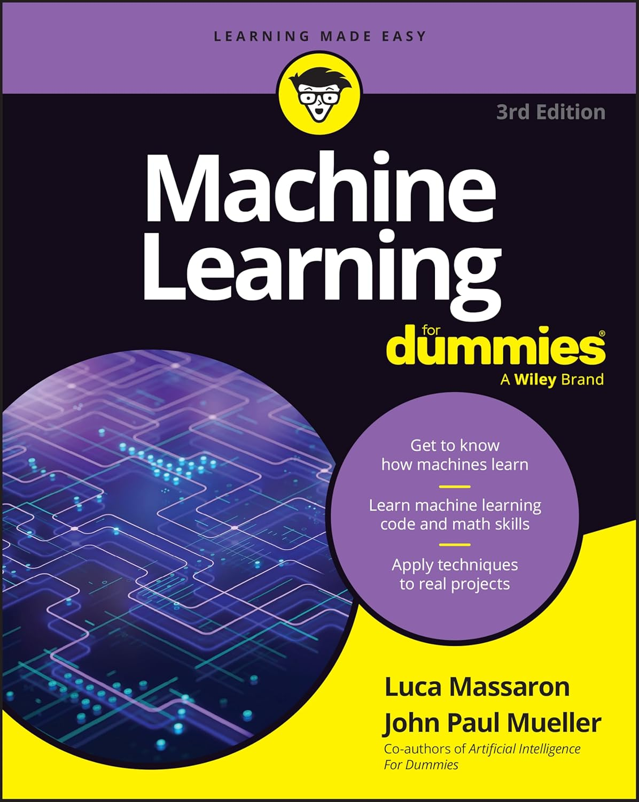

# Machine Learning For Dummies, 3rd Edition



## Your plain-English, BRAND-NEW guide to machine learning

This repository contains the companion Jupyter Notebooks for the book "Machine Learning For Dummies, 3rd Edition" by Luca Massaron and John Paul Mueller.

Machine learning is fascinating, and its applications are everywhere. But if you’re a beginner, it can seem intimidating. This book is your guide through the complexities of machine learning. You’ll find out what it is, how it works, and how you can use it in your own projects.

With the help of this book and the code in this repository, you will:
*   Get a handle on the history of machine learning and its real-world applications.
*   Write your own machine learning algorithms.
*   Grind through the math behind machine learning and see how it all works.
*   Integrate machine learning into larger programming and data science projects.

## About this Repository

This repository holds the Jupyter Notebooks (`.ipynb` files) that accompany each chapter of the book, allowing you to follow along with the examples and execute the code yourself.

### Notebooks Included:

Each notebook can be opened directly in Google Colab by clicking on the corresponding link.

*   [](https://colab.research.google.com/github/lmassaron/ml4dummies_3ed/blob/main/ML4D3E_05_understanding_the_tools_of_the_trade.ipynb) `ML4D3E_05_understanding_the_tools_of_the_trade.ipynb`
*   [](https://colab.research.google.com/github/lmassaron/ml4dummies_3ed/blob/main/ML4D3E_5_getting_beyond_basic_coding_in_python.ipynb) `ML4D3E_5_getting_beyond_basic_coding_in_python.ipynb`
*   [](https://colab.research.google.com/github/lmassaron/ml4dummies_3ed/blob/main/ML4D3E_07_demystifying_the_math_behind_machine_learning.ipynb) `ML4D3E_07_demystifying_the_math_behind_machine_learning.ipynb`
*   [](https://colab.research.google.com/github/lmassaron/ml4dummies_3ed/blob/main/ML4D3E_09_validating_machine_learning.ipynb) `ML4D3E_09_validating_machine_learning.ipynb`
*   [](https://colab.research.google.com/github/lmassaron/ml4dummies_3ed/blob/main/ML4D3E_10_starting_with_simple_learners.ipynb) `ML4D3E_10_starting_with_simple_learners.ipynb`
*   [](https://colab.research.google.com/github/lmassaron/ml4dummies_3ed/blob/main/ML4D3E_11_leveraging_similarity.ipynb) `ML4D3E_11_leveraging_similarity.ipynb`
*   [](https://colab.research.google.com/github/lmassaron/ml4dummies_3ed/blob/main/ML4D3E_12_working_with_linear_models_the_easy_way.ipynb) `ML4D3E_12_working_with_linear_models_the_easy_way.ipynb`
*   [](https://colab.research.google.com/github/lmassaron/ml4dummies_3ed/blob/main/ML4D3E_13_going_beyond_the_basics_with_support_vector_machines.ipynb) `ML4D3E_13_going_beyond_the_basics_with_support_vector_machines.ipynb`
*   [](https://colab.research.google.com/github/lmassaron/ml4dummies_3ed/blob/main/ML4D3E_14_tackling_complexity_with_neural_networks.ipynb) `ML4D3E_14_tackling_complexity_with_neural_networks.ipynb`
*   [](https://colab.research.google.com/github/lmassaron/ml4dummies_3ed/blob/main/ML4D3E_15_resorting_to_ensembles_of_learners.ipynb) `ML4D3E_15_resorting_to_ensembles_of_learners.ipynb`
*   [](https://colab.research.google.com/github/lmassaron/ml4dummies_3ed/blob/main/ML4D3E_16_classifying_images.ipynb) `ML4D3E_16_classifying_images.ipynb`
*   [](https://colab.research.google.com/github/lmassaron/ml4dummies_3ed/blob/main/ML4D3E_17_scoring_opinions_and_sentiments.ipynb) `ML4D3E_17_scoring_opinions_and_sentiments.ipynb`
*   [](https://colab.research.google.com/github/lmassaron/ml4dummies_3ed/blob/main/ML4D3E_18_recommending_products_and_movies.ipynb) `ML4D3E_18_recommending_products_and_movies.ipynb`

## How to Use the Code

The easiest way to run these notebooks is by using Google Colab. You can open any notebook directly in Colab by clicking the "Open in Colab" badge next to its name in the list above. This requires no local installation.

### Local Installation (Alternative)

If you prefer to run the notebooks on your own machine, you will need a Python environment with Jupyter Notebook or JupyterLab installed. It is also recommended to have the core data science libraries available, such as:

*   CatBoost
*   Datasets
*   dtreeviz
*   JAX
*   Keras
*   LightGBM
*   Matplotlib
*   NLTK
*   Numpy
*   Pandas
*   Scikit-learn
*   Scipy
*   Seaborn
*   Skimage
*   Transformers
*   XGBoost

You can typically install these packages using `pip`:
```bash
pip install numpy pandas scikit-learn matplotlib seaborn dtreeviz keras nltk xgboost lightgbm catboost datasets transformers scipy scikit-image jax jupyter
```

After installing the prerequisites, you can launch Jupyter Notebook or JupyterLab from your terminal and navigate to the directory containing these files to open and run them.

## About the Authors

**Luca Massaron** is a data scientist who specializes in organizing and interpreting big data. He is a Google Developer Expert (GDE) in machine learning.

**John Paul Mueller** was a long-time tech author whose credits include previous editions of this book along with Artificial Intelligence For Dummies and Algorithms For Dummies.

## Where to Buy

You can purchase your copy of "Machine Learning For Dummies, 3rd Edition" from the official Wiley website:
[https://www.wiley.com/en-us/Machine+Learning+For+Dummies%2C+3rd+Edition-p-9781394373222](https://www.wiley.com/en-us/Machine+Learning+For+Dummies%2C+3rd+Edition-p-9781394373222)